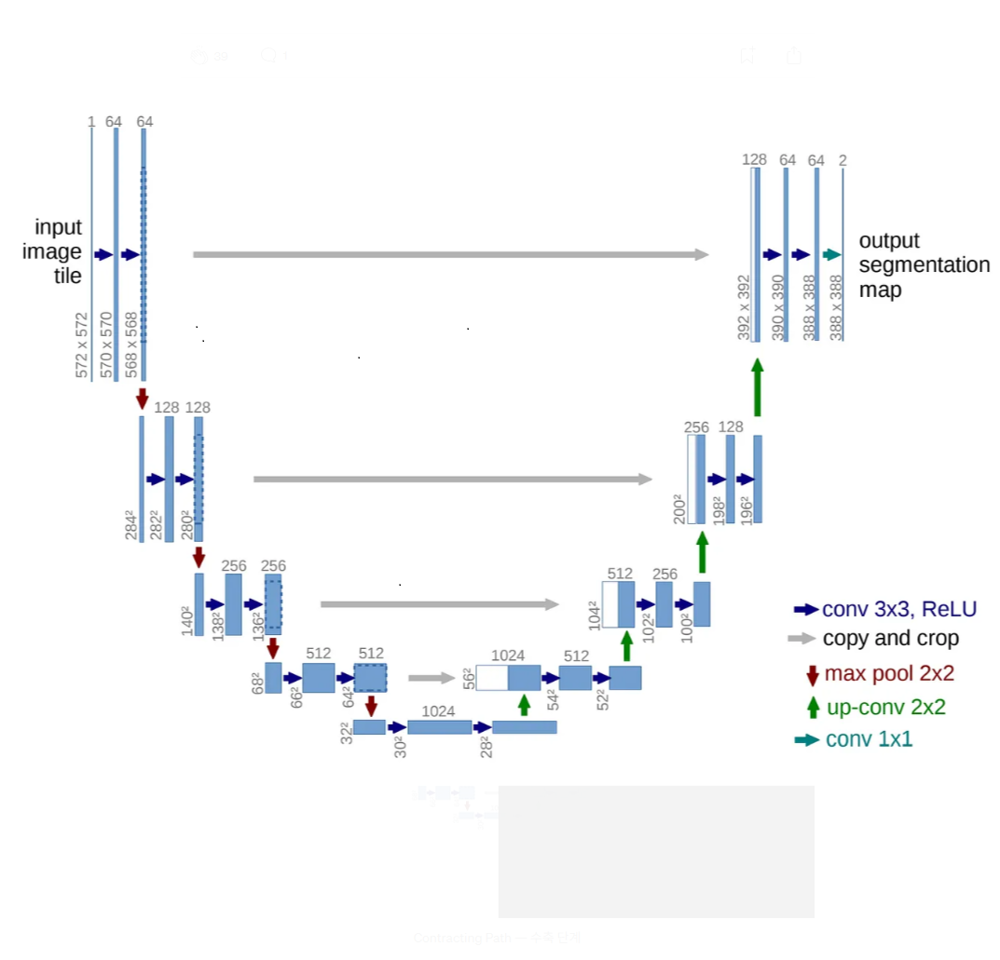
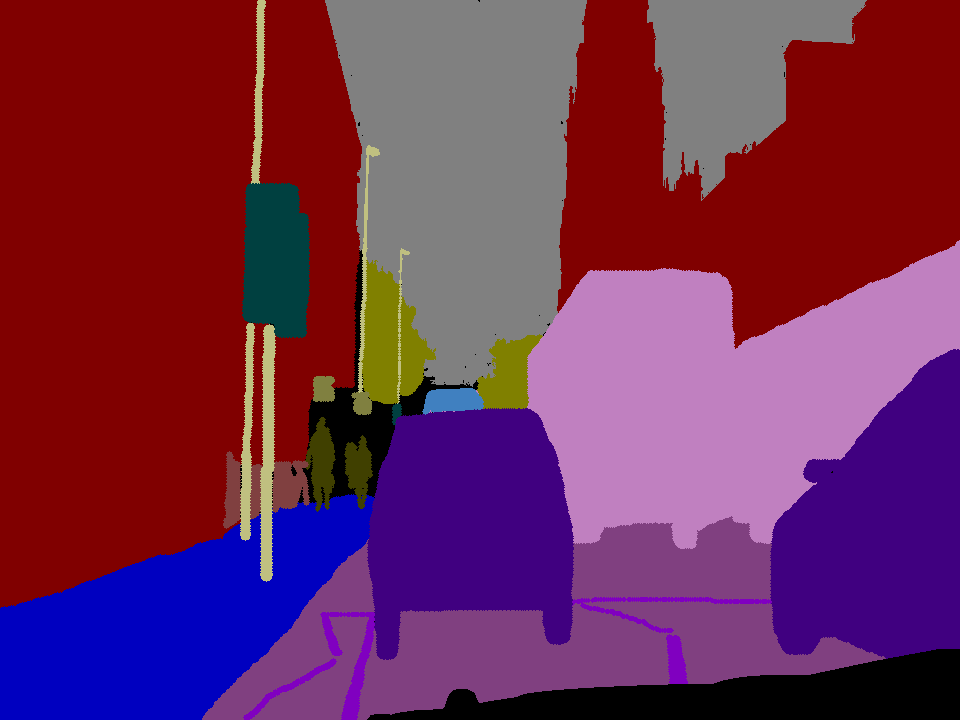

# UNet 모델 학습

## UNet 구조


- 모델 클래스 설계 
```python
import tensorflow as tf
from tensorflow.keras import layers, Model
from tensorflow.keras.utils import register_keras_serializable

@register_keras_serializable()
class UNet(Model):
    def __init__(self, num_classes=2, **kwargs):
        super(UNet, self).__init__(**kwargs)

        self.num_classes = num_classes
        
        # Contracting path (downsampling)
        self.down1 = self.conv_block(64)
        self.pool1 = layers.MaxPooling2D((2, 2))

        self.down2 = self.conv_block(128)
        self.pool2 = layers.MaxPooling2D((2, 2))

        self.down3 = self.conv_block(256)
        self.pool3 = layers.MaxPooling2D((2, 2))

        self.down4 = self.conv_block(512)
        self.pool4 = layers.MaxPooling2D((2, 2))

        # Bottleneck
        self.bottleneck = self.conv_block(1024)

        # Expansive path (upsampling)
        self.upconv4 = layers.Conv2DTranspose(512, (2, 2), strides=(2, 2), padding="same")
        self.up4 = self.conv_block(512)

        self.upconv3 = layers.Conv2DTranspose(256, (2, 2), strides=(2, 2), padding="same")
        self.up3 = self.conv_block(256)

        self.upconv2 = layers.Conv2DTranspose(128, (2, 2), strides=(2, 2), padding="same")
        self.up2 = self.conv_block(128)

        self.upconv1 = layers.Conv2DTranspose(64, (2, 2), strides=(2, 2), padding="same")
        self.up1 = self.conv_block(64)

        # Final 1x1 convolution
        
        self.final_conv = layers.Conv2D(num_classes, (1, 1), activation='softmax' if num_classes > 1 else 'sigmoid')

    def conv_block(self, filters):
        return tf.keras.Sequential([
            layers.Conv2D(filters, (3, 3), activation='relu', padding='same'),
            layers.Conv2D(filters, (3, 3), activation='relu', padding='same')
        ])

    def call(self, x):
        # Contracting
        c1 = self.down1(x)
        p1 = self.pool1(c1)

        c2 = self.down2(p1)
        p2 = self.pool2(c2)

        c3 = self.down3(p2)
        p3 = self.pool3(c3)

        c4 = self.down4(p3)
        p4 = self.pool4(c4)

        # Bottleneck
        bn = self.bottleneck(p4)

        # Expanding
        u4 = self.upconv4(bn)
        u4 = tf.concat([u4, c4], axis=-1)
        u4 = self.up4(u4)

        u3 = self.upconv3(u4)
        u3 = tf.concat([u3, c3], axis=-1)
        u3 = self.up3(u3)

        u2 = self.upconv2(u3)
        u2 = tf.concat([u2, c2], axis=-1)
        u2 = self.up2(u2)

        u1 = self.upconv1(u2)
        u1 = tf.concat([u1, c1], axis=-1)
        u1 = self.up1(u1)

        return self.final_conv(u1)
   ```
   
## 학습데이터
- CamVid
    - 도로 주행 데이터 셋
        - 이미지 + 마스크 / 클래스 32개
        - [다운로드 경로(캐글)](https://www.kaggle.com/datasets/carlolepelaars/camvid)
    - 마스크 이미지 (색상채널 추가 예시)
    
    - 마스크 이미지 (256, 256) 전처리 필요


